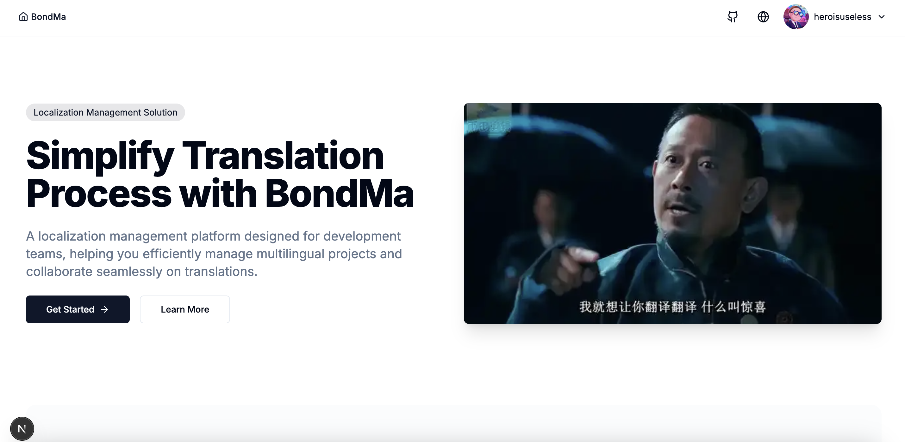
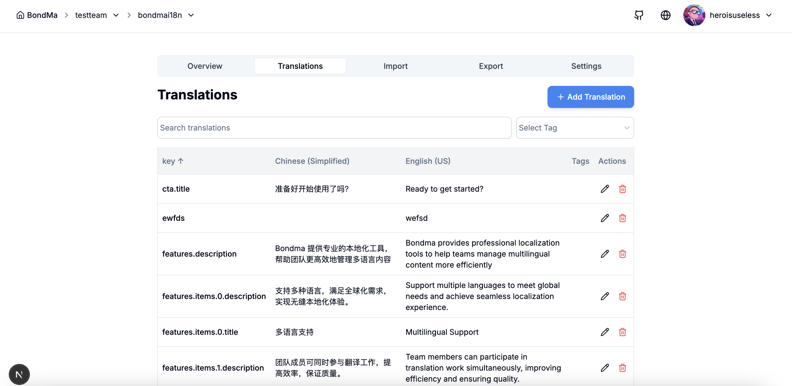
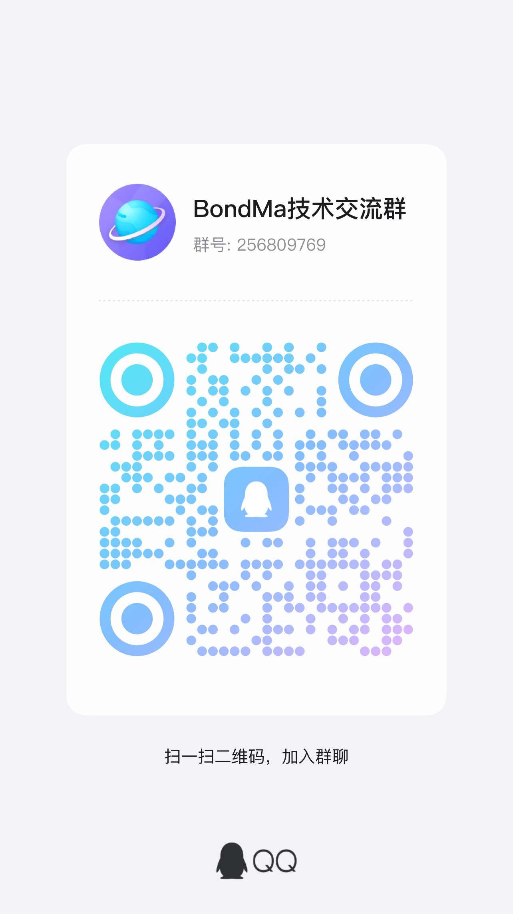
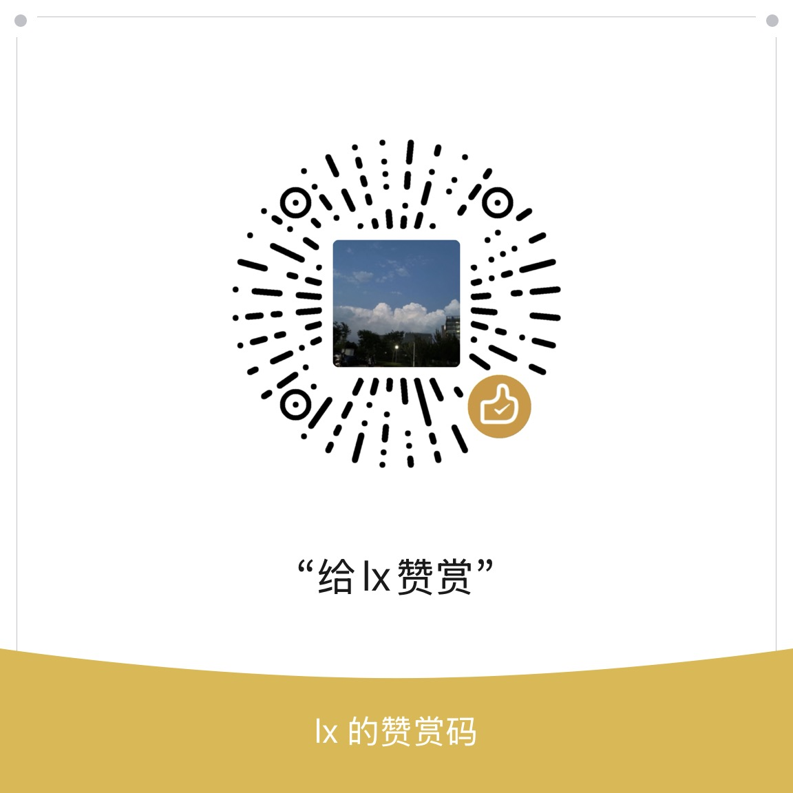

# Bondma - Multilingual Translation Management Platform
[中文文档](./doc/readme/zh.md)

## Project Overview

Bondma is a modern multilingual translation management platform designed to simplify the internationalization (i18n) process for applications and websites. It provides an intuitive user interface to help teams efficiently manage, translate, and synchronize multilingual content.

How to use: This project has separated frontend and backend and is completely open-source, built with Nextjs + Nestjs. After deployment, you can visually manage internationalization entries on this translation platform, and it features open APIs that make it convenient to retrieve all entries via scripts. It's suitable for collaborative work between product translation and development during project development, improving communication efficiency.

This platform implements "bootstrapping", meaning it uses itself to manage all internationalization entries within the platform project.

The naming inspiration for this platform comes from the character Tang Shiye (also known as Bond Ma) from the movie "Let the Bullets Fly", who was skilled in English and translation.





## Key Features

- **Team Collaboration**: Supports multiple team members collaborating on translation projects with role-based permission management
- **Multi-language Support**: Add unlimited languages, supporting all major languages
- **Import/Export**: Support for importing and exporting in various formats including JSON, CSV, YAML, XML, etc.
- **Version Control**: Track content change history to ensure translation consistency
- **API Integration**: Provides REST API for seamless integration with CI/CD workflows
- **Secure and Reliable**: Encrypted data storage with secure access control

## Tech Stack

- **Frontend**: Next.js, React, TailwindCSS, Jotai
- **Backend**: NestJS, MongoDB
- **Deployment**: Docker, Kubernetes

## Quick Start
```
pnpm i
```

```
mongod --config /Users/heroisuseless/Documents/GitHub/bondma/conf/mongo.conf
```

```
cd packages/server
pnpm run start
```

```
cd packages/web
pnpm run dev
```

### Prerequisites

- Node.js 18+
- MongoDB
- Docker (optional)

### Contact




### Donation




