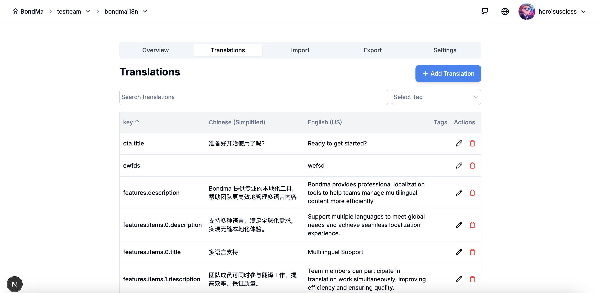
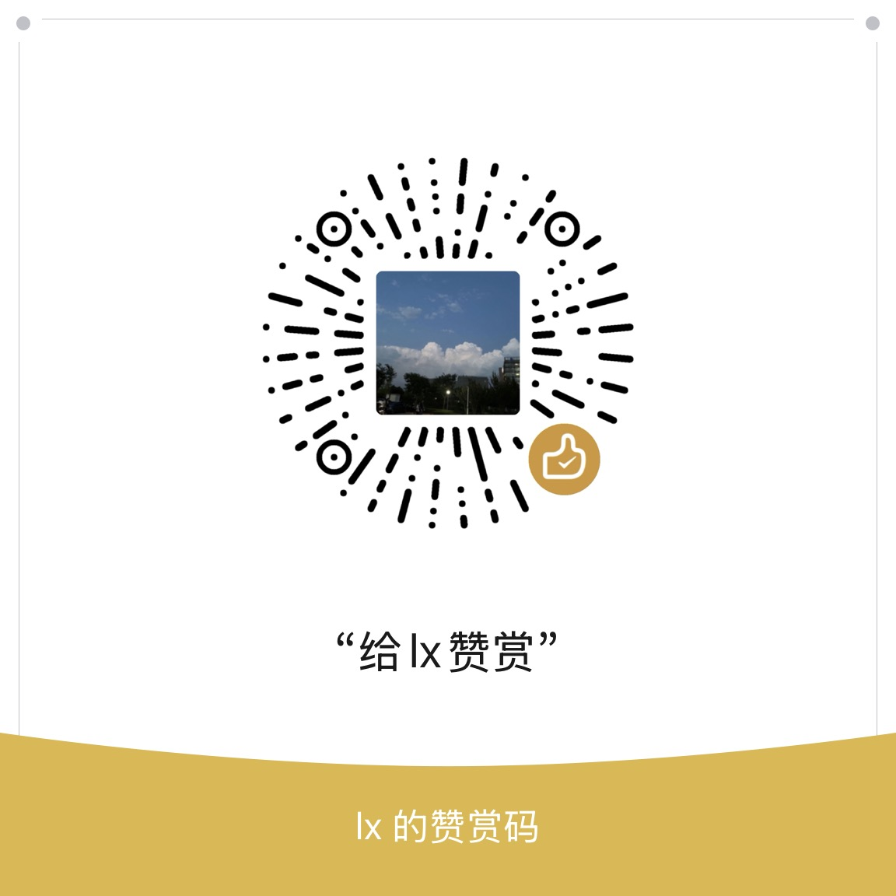

# Bondma - 多语言翻译管理平台

## 项目简介

Bondma 是一个现代化的多语言翻译管理平台，旨在简化应用程序和网站的国际化(i18n)流程。它提供了直观的用户界面，帮助团队高效管理、翻译和同步多语言内容。

如何使用：本项目前后端分离并完全开源，采用Nextjs+Nestjs架构，部署该项目后即可在该翻译平台上可视化地管理国际化词条，并设计有开放api方便用脚本拉取所有词条。适用于项目需求开发过程中产品翻译与开发之间的协同工作，提高沟通效率。

本平台实现了“自举”，即用本平台来管理本平台项目中的所有国际化词条。

本平台的取名灵感来源于电影《让子弹飞》中的角色汤师爷，也叫马邦德，擅长英语和翻译。




## 主要特性

- **团队协作**：支持多团队成员共同参与翻译项目，角色权限管理
- **多语言支持**：无限制添加语言，支持所有主流语言
- **导入导出**：支持JSON、CSV、YAML、XML等多种格式的导入导出
- **版本管理**：追踪文案变更历史，确保翻译一致性
- **API集成**：提供REST API，可与CI/CD流程无缝集成
- **安全可靠**：数据加密存储，安全访问控制

## 技术栈

- **前端**：Next.js, React, TailwindCSS, Jotai
- **后端**：NestJS, MongoDB
- **部署**：Docker, Kubernetes

## 快速开始
```
pnpm i
```

```
mongod --config /Users/heroisuseless/Documents/GitHub/bondma/conf/mongo.conf
```

```
cd packages/server
pnpm run start
```

```
cd packages/web
pnpm run dev
```

### 前置条件

- Node.js 18+
- MongoDB
- Docker (可选)

### 联系方式


### 打赏




